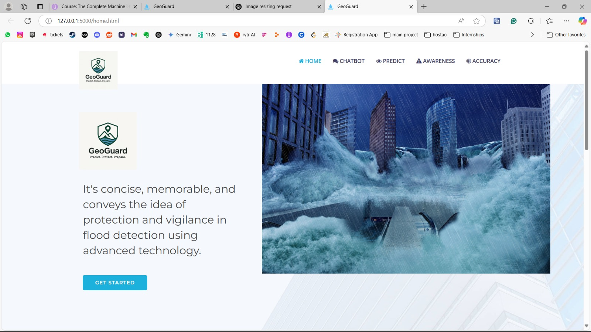
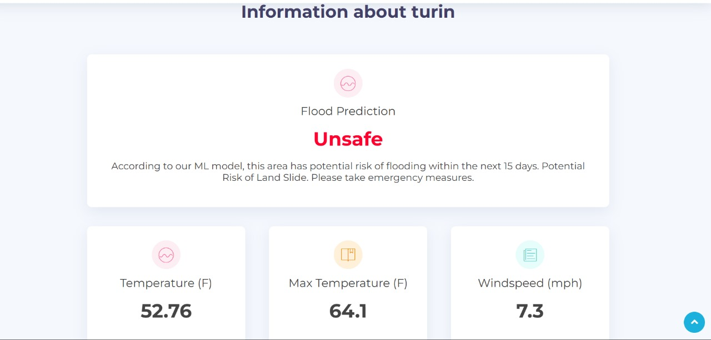

# Geoguard: Flood and Landslide Prediction System

An intelligent disaster preparedness platform that combines machine learning predictions with comprehensive disaster awareness and emergency support. Geoguard empowers communities with real-time risk assessment, educational content, emergency contacts, and disaster preparedness tools.

## Features

### Core Prediction System
- **Real-time ML Predictions**: RNN (Recurrent Neural Networks) models for accurate flood and landslide risk prediction
- **Meteorological Data Integration**: Analyzes temperature, wind speed, cloud cover, precipitation, and humidity
- **Real-time Geolocation API** (HERE Maps): Automatic location detection with geocoding for precise city-level risk assessment. Users can allow geolocation access for instant location-based predictions or manually select cities across India and internationally (Delhi, Mumbai, Kolkata, Bangalore, Chennai, New York, Los Angeles, London, Paris, Sydney, Beijing)
- **Interactive Risk Dashboard**: Visual risk indicators for multiple Indian cities

### Disaster Awareness & Education
- **AI-Powered Multilingual Chatbot**: Supports 13 Indian languages for disaster preparedness information
- **Interactive Disaster Quizzes**: Test your knowledge on earthquake safety, flood preparedness, tsunami awareness, and emergency protocols
- **Educational Video Library**: Curated videos for different disaster types with safety guidelines
- **Emergency Contact Database**: Comprehensive emergency helpline numbers for all Indian states and union territories
- **Interactive Disaster Games**: Engaging games to learn disaster preparedness concepts

### Historical Analysis
- **Disaster Event History**: Detailed records of past disasters in India (location, year, impact)
- **Pattern Recognition**: Analyze historical trends to understand disaster-prone regions
- **Knowledge Base**: Learn from past events to improve future preparedness

## Tech Stack

- **Backend**: Python Flask
- **Machine Learning**: TensorFlow/Keras with RNN models (Joblib/Pickle for serialization)
- **Frontend**: HTML5, CSS3, JavaScript, Bootstrap
- **APIs**: 
  - **HERE Maps Geolocation API** (Real-time city to coordinates conversion for accurate location detection)
  - Google Translate API (googletrans)
- **NLP**: NLTK (Natural Language Toolkit) for chatbot intelligence
- **Database**: JSON-based data storage for disasters, helplines, and historical events

## Installation

### Prerequisites
- Python 3.7+
- pip (Python package manager)
- Modern web browser
- HERE Maps API key (free tier available)

### Setup Steps

1. **Clone the Repository**
   \`\`\`bash
   git clone https://github.com/yourusername/geoguard-flood-landslide-prediction.git
   cd geoguard-flood-landslide-prediction
   \`\`\`

2. **Create Virtual Environment**
   \`\`\`bash
   python -m venv venv
   source venv/bin/activate  # On Windows: venv\Scripts\activate
   \`\`\`

3. **Install Dependencies**
   \`\`\`bash
   pip install -r requirements.txt
   \`\`\`

4. **Configure Geolocation API**
   - Obtain API key from https://www.visualcrossing.com/weather-api/
   - Add your API key to the Flask application configuration or environment variables

5. **Download NLTK Data** (for chatbot)
   \`\`\`python
   python -c "import nltk; nltk.download('stopwords'); nltk.download('wordnet')"
   \`\`\`

6. **Run the Application**
   \`\`\`bash
   python app.py
   \`\`\`
   
   The application will be available at \`http://127.0.0.1:5000\`

## Usage

### Home Page
- View real-time risk predictions for major Indian cities
- Access quick links to all features
- See current disaster awareness information
  

### Risk Prediction with Geolocation
1. Navigate to the prediction section
2. **Allow geolocation access** to automatically detect your location using HERE Maps API (or manually select a city)
3. The system converts your city selection to precise latitude/longitude coordinates
4. View detailed risk assessment for floods and landslides in your area
5. Check meteorological data influencing predictions for your location
   

**How Geolocation Works:**
- User selects a city → HERE Maps Geocoding API retrieves coordinates → Weather data fetched for those coordinates → ML model predicts risk based on meteorological data

### Disaster Chatbot
1. Open the chatbot interface
2. Ask questions about disaster preparedness in any of 13 supported Indian languages
3. Get information about:
   - Prevention and preparation measures
   - What to do during a disaster
   - Recovery procedures
   - Emergency helpline numbers
   - Historical disaster information

### Educational Resources
- **Quizzes**: Test your disaster awareness knowledge (15+ questions)
- **Videos**: Watch safety-focused educational videos
- **Emergency Contacts**: Find helpline numbers for your state or region
- **Games**: Learn preparedness through interactive gaming

## Project Structure

\`\`\`
geoguard-flood-landslide-prediction/
├── app.py                      # Main Flask application with geolocation integration
├── chatbot.py                  # AI chatbot logic with NLP
├── training.py                 # ML model training and prediction
├── requirements.txt            # Python dependencies
├── data/
│   ├── disaster_data.json      # Disaster information database
│   ├── helpline_numbers.json   # Emergency contact database
│   └── historical_disasters.json # Historical disaster records
├── models/
│   ├── flood_model.pkl         # Trained RNN model for flood prediction
│   └── landslide_model.pkl     # Trained RNN model for landslide prediction
├── static/
│   ├── css/                    # Stylesheets
│   ├── js/                     # JavaScript (chatbot, quiz, games)
│   └── img/                    # Images and diagrams
└── templates/
    ├── index.html              # Home page
    ├── prediction.html         # Risk prediction page with geolocation
    ├── chatbot.html            # Chatbot interface
    ├── quiz.html               # Quiz page
    └── emergency.html          # Emergency contacts page
\`\`\`

## Machine Learning Models

### Model Architecture
- **Algorithm**: RNN (Recurrent Neural Networks)
- **Input Features**: Meteorological parameters (6 features: temperature, max temperature, wind speed, cloud cover, precipitation, humidity)
- **Output**: Risk probability (0-1 scale)
- **Training Data**: Historical weather and disaster correlations

### Model Performance
- Accuracy metrics included in model training pipeline
- Continuous learning capability with new disaster data
- Cross-validation for reliability

## Geolocation API Integration

### HERE Maps Geocoding API
Geoguard uses the HERE Maps Geocoding API to convert city names into precise geographic coordinates:

\`\`\`python
# Example: Convert city name to coordinates
# Input: "Delhi"
# Output: Latitude: 28.6139, Longitude: 77.2090

# API Endpoint: https://www.visualcrossing.com/weather-api/
# Params: apikey, q (query city name)
# Response: JSON with location details including lat/lng
\`\`\`

**Benefits:**
- Accurate geographic coordinates for any city
- Support for international and Indian cities
- Real-time location-based predictions
- Seamless user experience with automatic location detection

## Emergency Helplines

Geoguard provides emergency contact information for:
- **National Level**: NDRF, Police, Fire, Ambulance, Disaster Management
- **State Level**: All 28 states and 8 union territories
- **Disaster-Specific**: Flood, earthquake, tsunami, landslide contacts

## Supported Languages

The multilingual chatbot supports:
- English
- Hindi
- Bengali
- Tamil
- Telugu
- Kannada
- Marathi
- Gujarati
- Punjabi
- Odia
- Malayalam
- Assamese
- Urdu

## Data Sources

- Meteorological data from IMD (Indian Meteorological Department)
- Historical disaster records from NDMA (National Disaster Management Authority)
- Emergency contact information from official government sources
- Emergency procedures from NDRF guidelines
- Geolocation data from HERE Technologies

## Future Enhancements

- Real-time weather data API integration
- Mobile app for iOS and Android
- SMS alerts for high-risk zones
- Community reporting features
- Integration with official disaster management systems
- Advanced ML models (LSTM, Transformer-based)
- Real-time geospatial mapping with risk zones
- Multi-language UI localization

## Contributing

Contributions are welcome! Please follow these steps:

1. Fork the repository
2. Create a feature branch (\`git checkout -b feature/AmazingFeature\`)
3. Commit your changes (\`git commit -m 'Add AmazingFeature'\`)
4. Push to the branch (\`git push origin feature/AmazingFeature\`)
5. Open a Pull Request

## License

This project is licensed under the MIT License - see the LICENSE file for details.

## Acknowledgments

- Indian Meteorological Department (IMD)
- National Disaster Management Authority (NDMA)
- National Disaster Response Force (NDRF)
- Natural Language Toolkit (NLTK) community
- TensorFlow and Keras teams
- HERE Technologies

## Contact & Support

For questions, suggestions, or support:
- Open an issue on GitHub
- Contact: [ansonapeter16@gmail.com]

## Disclaimer

Geoguard provides predictive insights based on available data and machine learning models. While predictions are designed to be accurate, they should not be the sole basis for emergency decisions. Always follow official disaster management guidelines and evacuate when instructed by local authorities.

---

**Made with ❤️ for disaster preparedness and community safety**
